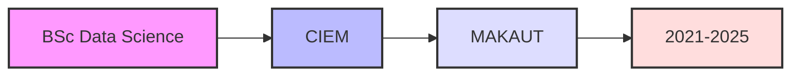

# 
🌟 Anik Das | Data Science Explorer 🚀

  

## 👨‍💻 About Me

I'm a passionate **Data Science** student at **Calcutta Institute of Engineering and Management**, driven by the power of data to transform insights into impact. Currently in my 3rd year, I'm on a mission to bridge the gap between complex data and actionable insights.

- 🔭 Currently working on **Advanced ML Projects**
- 🌱 Learning **Deep Learning** & **Natural Language Processing**
- 👯 Looking to collaborate on **Data Science Projects**
- 💬 Ask me about **Python, ML, Data Analysis**
- ⚡ Fun fact: I can explain complex algorithms using food analogies! 🍕

 

## 🎓 Education

  

## 🛠️ Tech Stack

### Languages & Tools

### Frameworks & Libraries

### Visualization Tools

## 📊 Skills Matrix

| Data Science | Machine Learning | Tools & Technologies |
|:------------:|:---------------:|:-------------------:|
| 📊 Data Analysis | 🤖 Supervised Learning | 💻 Git & GitHub |
| 📈 Statistical Analysis | 🧠 Neural Networks | ☁️ Cloud Platforms |
| 📉 Time Series Analysis | 🔍 Deep Learning | 🛠️ Docker |
| 🔍 Data Mining | 📝 NLP | 📊 Jupyter Notebook |

## 📈 GitHub Analytics

  
  

## 🏆 GitHub Profile Trophy

## 📚 Latest Projects

## 🔥 Streak Stats

## 🌐 Connect with Me

  

## 📊 Contribution Graph

  

---

  
### 🎯 "Data is the new oil, but like oil, it's valuable only when refined." 
  

⭐️ From [Anik Das](https://github.com/anikdascodes)

