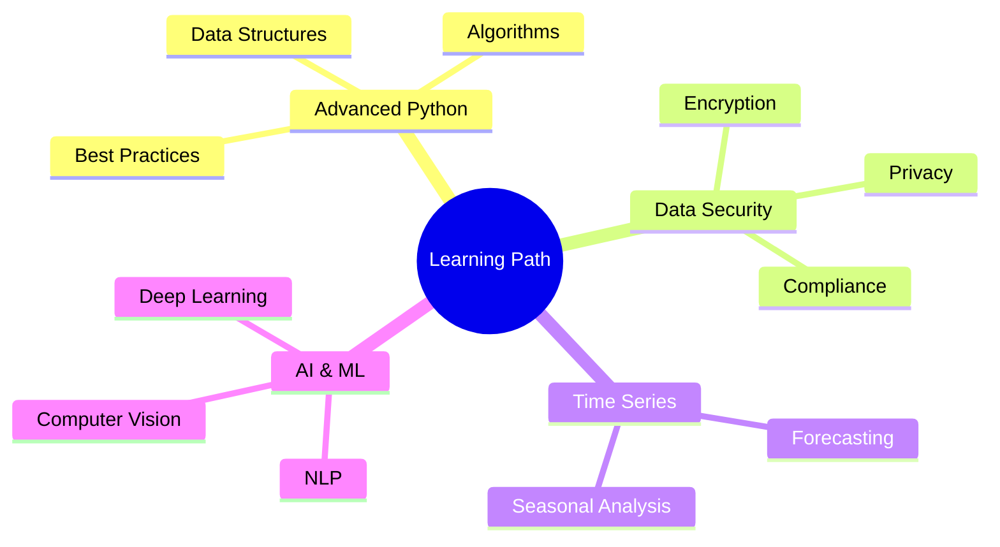

<!-- Banner Image -->

  

<h1 align="center">
   
  Hi there, I'm Anik Das
  
</h1>

  

  

## 🚀 About Me

I'm a passionate Data Science student currently in my 3rd year (5th semester) at the Calcutta Institute of Engineering and Management, affiliated with Maulana Abul Kalam Azad University of Technology, West Bengal. I thrive on:

- 📊 Transforming raw data into meaningful insights
- 🤖 Exploring the latest in AI & Machine Learning
- 📈 Creating impactful data visualizations
- 🎯 Solving complex problems with data-driven approaches

 

## 🎓 Education Journey

  

- **Degree**: BSc in Data Science (3rd Year)
- **Institution**: Calcutta Institute of Science and Management
- **University**: Maulana Abul Kalam Azad University of Technology, West Bengal

## 💡 Skills & Tech Stack

  

### Programming & Tools

  
  
  
  

### Data Visualization

  
  
  

### Areas of Expertise

  
| Data Science | Analytics | Advanced Topics |
|:------------:|:---------:|:---------------:|
| 📊 Data Visualization | 📈 Statistical Analysis | 🤖 Machine Learning |
| 🧮 Regression Analysis | ⏳ Time Series Analysis | 🔐 Data Security |
| 📉 Predictive Modeling | 🎯 Data-Driven Decision Making | 🕸️ Web Intelligence |
| 📊 Data Preprocessing | 📈 Exploratory Analysis | 🧠 Artificial Intelligence |

## 🌱 Currently Learning & Growing

  

## 📚 Notable Coursework

  

<table align="center">
  <tr>
    <td align="center">📊 Data Visualization</td>
    <td align="center">📉 Statistical Analysis</td>
    <td align="center">📈 Regression Analysis</td>
  </tr>
  <tr>
    <td align="center">🧮 Linear Models</td>
    <td align="center">🐍 Advanced Python</td>
    <td align="center">🔒 Data Security</td>
  </tr>
  <tr>
    <td align="center">⏰ Time Series</td>
    <td align="center">🌐 Web Intelligence</td>
    <td align="center">🤖 AI & ML Fundamentals</td>
  </tr>
</table>

## 📊 GitHub Statistics

  
  <!-- GitHub Stats Card -->
  
  
  <!-- GitHub Streak Stats -->
  

  <!-- Most Used Languages -->
  
  
  <!-- Activity Graph -->
  

## 📫 Let's Connect and Collaborate!

   <em>I love connecting with fellow data enthusiasts!</em>

  
  
  

  

---

<h3 align="center">
  
  Thanks for visiting! Don't forget to star ⭐ some repositories!
  
</h3>

  

